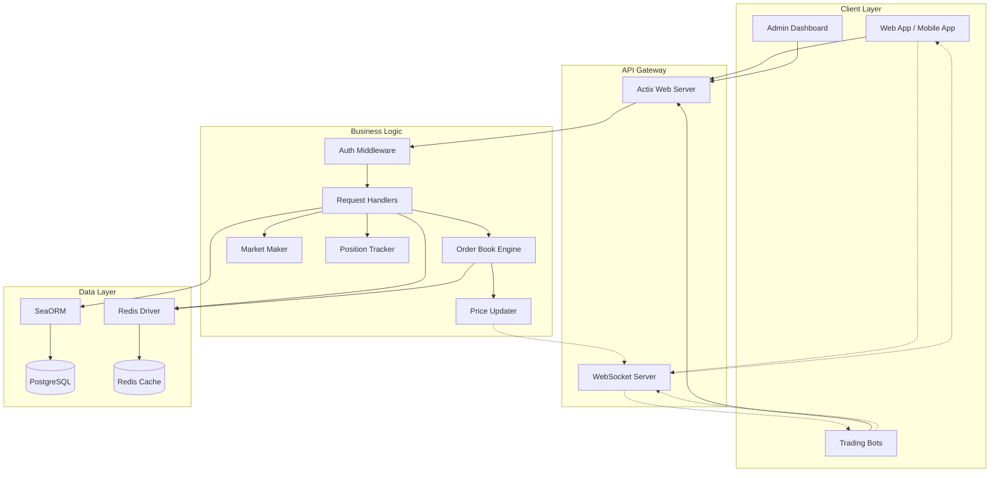

# Architecture

## System Overview

## Component Description

- **Actix Web Server** — Handles all REST API requests with actor-based concurrency
- **WebSocket Server** — Manages real-time connections for live order book and price updates
- **Auth Middleware** — JWT-based authentication and role-based authorization (user/admin)
- **Order Book Engine** — In-memory order matching supporting Market, Limit, IOC, FOK, and GTC orders
- **Market Maker** — Automated liquidity provisioning for new markets
- **Position Tracker** — Real-time portfolio and position management per user
- **Price Updater** — Continuous price discovery from order flow, broadcasts via WebSocket
- **SeaORM** — Type-safe database layer for PostgreSQL persistence
- **Redis Cache** — High-performance caching for frequently accessed data (order books, prices)
